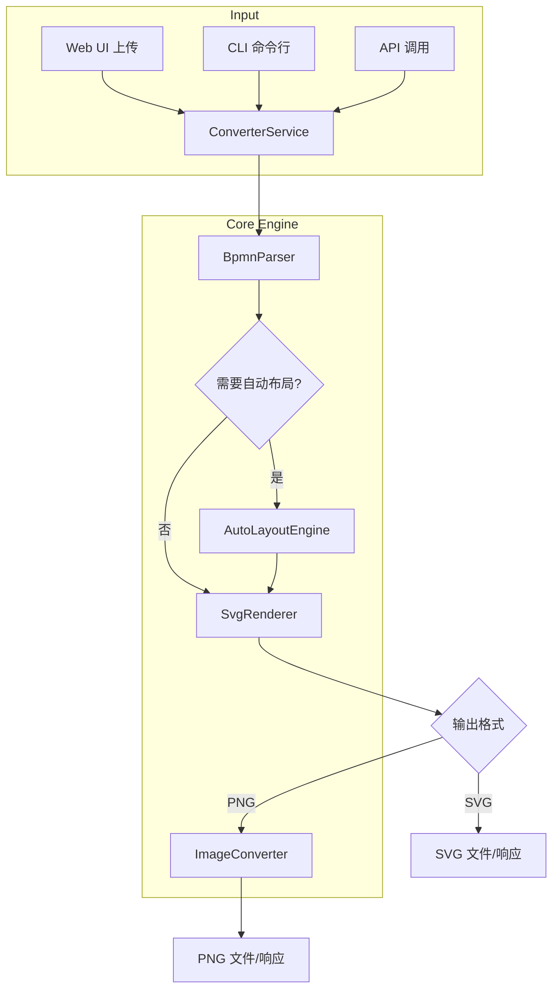
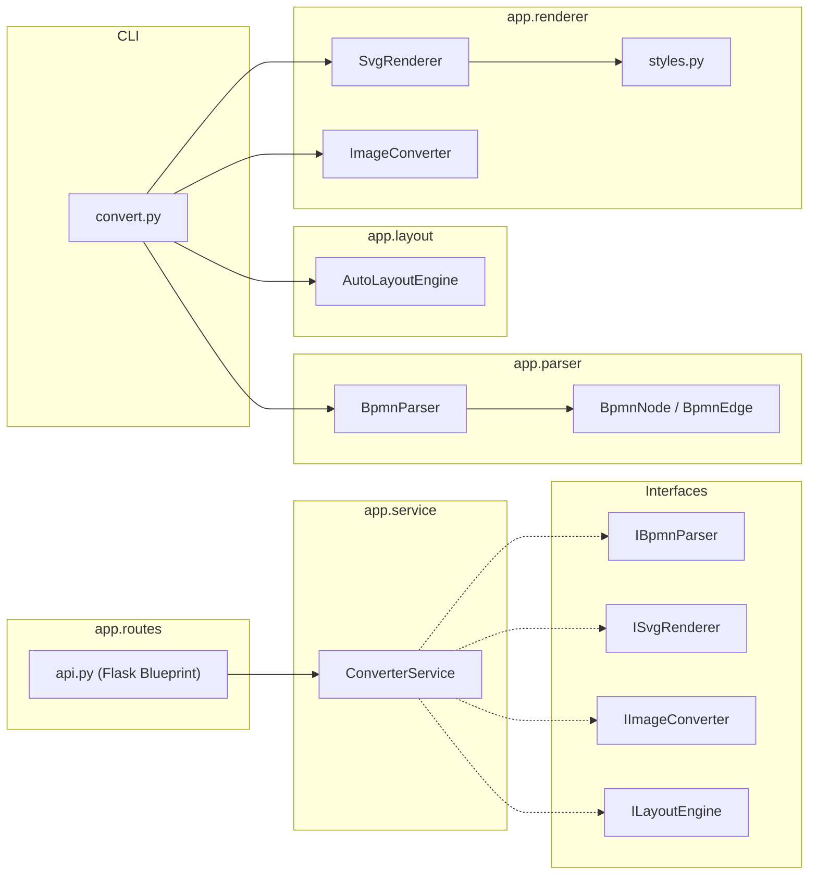

# BPMN to Image Converter - 项目设计文档

## 1. 系统架构



## 2. 模块设计



## 3. 项目结构

```
backend/
├── app/
│   ├── __init__.py
│   ├── config.py                  # 应用配置（SECRET_KEY, CORS, 文件限制等）
│   ├── exceptions.py              # 全局异常定义 + Flask 错误处理器
│   ├── interfaces.py              # Protocol 接口（DI 契约）
│   ├── parser/
│   │   ├── models.py              # BpmnNode, BpmnEdge 数据模型
│   │   └── bpmn_parser.py         # BPMN 2.0 XML 解析器
│   ├── layout/
│   │   └── auto_layout.py         # Sugiyama 分层自动布局引擎
│   ├── renderer/
│   │   ├── styles.py              # 渲染样式定义（颜色/字体/图标）
│   │   ├── svg_renderer.py        # SVG 渲染引擎
│   │   └── image_converter.py     # SVG → PNG 转换（CairoSVG）
│   ├── service/
│   │   ├── __init__.py            # 工厂函数 create_converter_service()
│   │   └── converter_service.py   # 转换编排服务（解析→布局→渲染→输出）
│   ├── routes/
│   │   └── api.py                 # Flask API 路由（/convert, /preview, /health）
│   └── main.py                    # Flask 应用工厂
├── static/
│   ├── index.html                 # Web UI
│   ├── style.css                  # 样式
│   └── app.js                     # 前端逻辑
├── tests/
│   ├── conftest.py                # pytest fixtures
│   ├── sample_data.py             # 测试用 BPMN 样本数据
│   ├── test_parser.py             # 解析器单元测试
│   ├── test_layout.py             # 布局引擎单元测试
│   ├── test_renderer.py           # 渲染器单元测试
│   ├── test_service.py            # 服务层单元测试（Mock DI）
│   ├── test_api.py                # API 集成测试
│   └── test_cli.py                # CLI 端到端测试
├── samples/
│   ├── sample.bpmn                # 示例（含 DI）
│   └── sample_no_di.bpmn          # 示例（无 DI，测试自动布局）
├── convert.py                     # CLI 入口
├── run.py                         # Web 服务入口
├── requirements.txt
├── pyproject.toml                 # pytest / ruff / mypy 配置
└── Dockerfile
```

## 4. BPMN 元素支持矩阵

| 元素类型 | 图形 | 支持状态 |
|---------|------|---------|
| StartEvent | 绿色圆形 | ✅ |
| EndEvent | 红色粗边圆形 | ✅ |
| IntermediateCatchEvent / ThrowEvent | 双边圆形 | ✅ |
| BoundaryEvent | 双边圆形 | ✅ |
| UserTask | 带人物图标圆角矩形 | ✅ |
| ServiceTask | 带齿轮图标圆角矩形 | ✅ |
| ScriptTask | 带脚本图标圆角矩形 | ✅ |
| BusinessRuleTask / SendTask / ReceiveTask / ManualTask | 圆角矩形 | ✅ |
| CallActivity | 粗边圆角矩形 | ✅ |
| SubProcess | 容器矩形 | ✅ |
| ExclusiveGateway | 菱形(X) | ✅ |
| ParallelGateway | 菱形(+) | ✅ |
| InclusiveGateway | 菱形(O) | ✅ |
| EventBasedGateway | 菱形(⬠) | ✅ |
| ComplexGateway | 菱形(✱) | ✅ |
| SequenceFlow | 实线箭头 | ✅ |
| MessageFlow | 虚线箭头 | ✅ |
| Association | 点线 | ✅ |
| Participant (Pool) | 泳道容器 + 垂直标签 | ✅ |

## 5. API 接口

| 方法 | 路径 | 说明 |
|------|------|------|
| GET | `/` | Web UI 页面 |
| GET | `/api/health` | 健康检查 |
| POST | `/api/convert` | 上传 BPMN 并下载转换后的图片 |
| POST | `/api/convert/preview` | 上传 BPMN 并返回 Base64 预览 |

### 公共参数（convert / preview 共用）

| 参数 | 类型 | 默认值 | 范围 | 说明 |
|------|------|--------|------|------|
| file | File | (必填) | .bpmn / .xml, ≤16MB | BPMN 文件 |
| format | string | png | png / svg | 输出格式 |
| dpi | int | 150 | 72-600 | PNG 分辨率 |
| scale | float | 2.0 | 0.5-5.0 | PNG 缩放倍数 |

## 6. UI/UX 规范

- 主色调: `#4A90D9` (BPMN蓝)
- 背景色: `#F0F2F5`
- 卡片背景: `#FFFFFF`，圆角 `12px`，阴影 `0 1px 3px rgba(0,0,0,0.08)`
- 字体: `Inter, -apple-system, BlinkMacSystemFont, sans-serif`
- 间距基准: `8px` 倍数（8/16/24）
- 按钮: hover 变色 + loading spinner
- 反馈: Toast 通知（success/error/warning）

## 7. 依赖注入架构

```
interfaces.py 定义 Protocol:
  IBpmnParser / ISvgRenderer / IImageConverter / ILayoutEngine

ConverterService 构造函数接收接口参数
service/__init__.py 的 create_converter_service() 负责组装具体实现
```

可替换场景：测试时注入 Mock，或替换为其他布局/渲染引擎。
